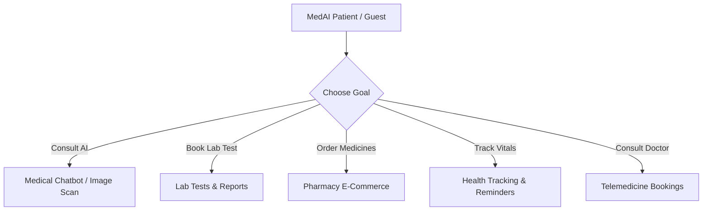

# MedAI - Intelligent AI-Powered Healthcare & Wellness Platform 🏥🤖

MedAI is a premium, open, full-stack digital health platform. It integrates a **FastAPI backend**, a **Vite + React frontend**, and a **Medical AI reasoning layer** with clinical image diagnosis, interactive chatbot sessions (utilizing RAG and LangChain), medicine reminder systems, and specialized role-aware dashboards (Patient, Doctor, and Admin).

---

## 🔗 Live Deployments

- **Frontend Application (Vercel)**: [https://med-ai-healthcare-platform.vercel.app/](https://med-ai-healthcare-platform.vercel.app/)
- **Backend API Server (Render)**: [https://medai-healthcare-platform-y8lf.onrender.com/](https://medai-healthcare-platform-y8lf.onrender.com/)
- **GitHub Repository**: [https://github.com/Vtsrinivas07/MedAI-Healthcare-Platform](https://github.com/Vtsrinivas07/MedAI-Healthcare-Platform)

---

## 👥 Demo Credentials for Testing

To log in and test the system immediately, use the credentials below:

| Portal | Role | Test Email | Password |
| :--- | :--- | :--- | :--- |
| **Admin Portal** | Administrator | `admin@medai.com` | `Admin@123` |
| **Doctor Portal** | Practitioner | `dr.aisha.patel@medai.demo` | `Doctor@123` |
| **Doctor Portal** | Practitioner | `dr.priya.sharma@medai.demo` | `Doctor@123` |
| **Patient Portal** | User | *Sign up with any email or log in via OTP/Google* | *Choose your own* |

---

# 📖 Guide for Non-Technical Users (Overview & How It Works)

If you are a doctor, patient, administrator, or product manager trying to understand how MedAI works, this section is for you.

### 🌟 Core Features



#### 1. AI Symptom Checker & Medical Chatbot 💬
* **What it is**: A smart chat assistant that behaves like a medical assistant.
* **How it works**: You type in your symptoms (e.g., *"I have a mild fever and a dry cough"*). The AI consults a built-in medical database to give you safe, structured information on what it could mean, along with lifestyle advice, warning signs, and matching local doctors to consult.
* **Important**: This is not a replacement for a real doctor. The AI will always warn you if emergency care is required.

#### 2. Medical Image Diagnosis 📷
* **What it is**: An AI eye that scans medical images.
* **How it works**: You upload an image (e.g., a skin rash, chest X-ray, eye scan, or bone X-ray). The AI analyzes the visual features and highlights suspected abnormalities (such as skin lesions, pneumonia, diabetic retinopathy, or bone fractures).

#### 3. Pharmacy & Medicine Reminders 💊
* **What it is**: An online pharmacy shop combined with an intelligent pill planner.
* **How it works**:
  * You search for medications, filter by health concern (e.g., Heart, Stomach, Skin), and add items to a cart to place an order.
  * You upload a photo of a written prescription, the AI reads it, parses the medicine details, and automatically adds them to your calendar as daily alarms.
  * The system alerts you when it's time to take your pills and lets you mark them as "Taken" to track your compliance.

#### 4. Lab Test Bookings 🧪
* **What it is**: A center for diagnostic and wellness tests.
* **How it works**: You choose a health package (e.g., Full Body Checkup, Women's Health, Kidney Profile). You book a slot, upload doctor prescriptions if required, and track your booking status until lab reports are generated and uploaded.

#### 5. Doctor Portal 🩺
* **What it is**: A dedicated system for medical professionals.
* **How it works**: Doctors log in to view their active appointments, launch voice/video/chat consultations with patients, write digital prescriptions, review patient health histories (vitals and logs), and update clinic operating hours and consultation fees.

#### 6. Admin Portal ⚙️
* **What it is**: The command center for the hospital network administrator.
* **How it works**: Admins monitor dashboard statistics (total patients, doctors, lab bookings, and completed consults), manage users, change roles (e.g., upgrading a patient to a doctor), and register new doctor accounts.

---

# 💻 Guide for Technical Users (Architecture & Development)

If you are a developer, devops engineer, or code auditor, this section outlines the system structure, API setup, database logic, and build settings.

### 🏗️ System Architecture

```
+---------------------------------------+
|          React + Vite Frontend        |  <--- Deployed on Vercel
+---------------------------------------+
                    |
                    | (Secured with JWT / Axios Interceptors)
                    v
+---------------------------------------+
|           FastAPI Web Server          |  <--- Deployed on Render (Python 3.11)
+---------------------------------------+
     |              |              |
     v              v              v
+---------+    +----------+   +----------+
| MongoDB |    |  Redis   |   |  Gemini  |
|  Atlas  |    | (Cache & |   |  AI API  |
|  (Data  |    |  Rate    |   |  (RAG /  |
| Store)  |    | Limiting)|   | Vision)  |
+---------+    +----------+   +----------+
```

### 🗄️ Database Collections
MongoDB Atlas is used for persistence. The core collections are:
* `users`: Stores patient, doctor, and admin profiles, hashed passwords, locations, and roles.
* `products`: E-commerce pharmacy inventory (seeded with 39 default medical products).
* `lab_tests`: Lab test packages (seeded with 18 standard panels).
* `lab_test_bookings`: Bookings matching users to tests, booking dates, statuses, and prescription attachments.
* `prescriptions`: Digital prescriptions issued by doctors or uploaded by patients.
* `consultations`: Telemedicine sessions mapping patient bookings to doctors, dates, types, and fees.
* `health_logs`: Time-series patient wellness logs (blood pressure, heart rate, symptoms).
* `medicine_reminders`: Alarms for medicine intakes (frequency, duration, times).

---

## 🛠️ Local Development Setup

### 1. Prerequisites
- **Python**: Version `3.10` or `3.11`
- **Node.js**: Version `18` or higher
- **Database**: MongoDB (Local Instance or Atlas Cluster URI)

### 2. Backend Setup
1. Open a terminal and navigate to the backend folder:
   ```bash
   cd backend
   ```
2. Create and activate a Python virtual environment:
   ```bash
   python -m venv .venv
   # Windows PowerShell:
   .venv\Scripts\Activate
   # macOS/Linux:
   source .venv/bin/activate
   ```
3. Install the dependencies:
   ```bash
   pip install -r requirements.txt
   ```
4. Create a `.env` file in the `backend/` directory using the following keys:
   ```env
   MONGODB_URI=mongodb+srv://<username>:<password>@cluster.mongodb.net/medai
   JWT_SECRET_KEY=generate_a_random_32_char_hex_string
   GOOGLE_CLIENT_ID=your-google-oauth-client-id
   GOOGLE_CLIENT_SECRET=your-google-oauth-client-secret
   ALLOWED_ORIGINS=http://localhost:5173
   DISABLE_REDIS=true  # Set to true if you are not running Redis locally
   
   # AI Settings
   AI_PROVIDER=gemini
   GEMINI_API_KEY=your-gemini-api-key
   GEMINI_MODEL=gemini-1.5-flash
   ```
5. Seed database collections (Lab Tests, Products, and Demo Doctors):
   ```bash
   python scripts/seed_products.py
   python scripts/seed_lab_tests.py
   python scripts/seed_demo_doctors.py
   # To reset/create the admin credentials (admin@medai.com / Admin@123):
   python -c "import os, asyncio, bcrypt; from dotenv import load_dotenv; from motor.motor_asyncio import AsyncIOMotorClient; load_dotenv();
   async def r():
       c = AsyncIOMotorClient(os.getenv('MONGODB_URI'))
       db = c.get_default_database()
       h = bcrypt.hashpw('Admin@123'.encode(), bcrypt.gensalt()).decode()
       await db.users.update_one({'email': 'admin@medai.com'}, {'$set': {'password_hash': h, 'role': 'admin'}}, upsert=True)
       print('Admin initialized!')
   asyncio.run(r())"
   ```
6. Start the FastAPI server:
   ```bash
   python main.py
   ```
   *The api docs will be available at: `http://localhost:8000/docs`*

### 3. Frontend Setup
1. Open a new terminal and navigate to the frontend folder:
   ```bash
   cd frontend
   ```
2. Install Node packages:
   ```bash
   npm install
   ```
3. Create a `.env` file in the `frontend/` directory:
   ```env
   VITE_API_URL=http://localhost:8000
   VITE_GOOGLE_CLIENT_ID=your-google-oauth-client-id
   ```
4. Run the Vite development server:
   ```bash
   npm run dev
   ```
   *The web client will be available at: `http://localhost:5173`*

---

## 🚀 Deployment Guide

### Render (Backend Deployment)
1. Set the **Root Directory** to `backend`.
2. Select **Python** as the runtime (or use the provided `Dockerfile`).
3. Set the build command:
   ```bash
   pip install -r ../requirements.txt
   ```
4. Set the start command:
   ```bash
   uvicorn main:app --host 0.0.0.0 --port $PORT
   ```
5. Add all required backend environment variables under the **Environment** tab in Render.
6. > [!TIP]
   > Set `DISABLE_REDIS=true` if you do not have a managed Redis instance attached to your Render service. The server will bypass local socket timeouts and boot instantly.

### Vercel (Frontend Deployment)
1. Add a new project and select the `frontend` folder of this repository.
2. Ensure **Framework Preset** is set to **Vite**.
3. Set the build command: `npm run build` and output directory: `dist`.
4. Configure the environment variables:
   - `VITE_API_URL`: Your backend URL (e.g. `https://medai-healthcare-platform-y8lf.onrender.com`).
   - `VITE_GOOGLE_CLIENT_ID`: Your Google OAuth Client ID.
5. > [!NOTE]
   > Single Page Application routing (reloads returning 404) is handled by the pre-configured [vercel.json](frontend/vercel.json) rewrite rules.

---

## ⚙️ Key Technical Fixes for Vercel/Render Compatibility
- **Redis Socket Timeouts**: Bypassed 2-second Redis connect attempts when running on cloud platforms (Render/Vercel) without remote cache instances, resolving slow API cold starts.
- **REST Method Mismatches**: Fixed HTTP method drift between frontend calls and backend definitions (aligned user role, lab booking, and prescription status changes to `PATCH` requests).
- **Hardcoded Endpoints**: Removed hardcoded production API URLs in pages (like `CreateDoctor.jsx`) and linked them to `import.meta.env.VITE_API_URL` to support multiple deployment environments.
- **Data Persistence Checks**: Added missing fields (`specialization`, `experience`, `consultationFee`) to `CreateDoctorRequest` in the API schema to ensure optional admin inputs persist successfully to MongoDB.
